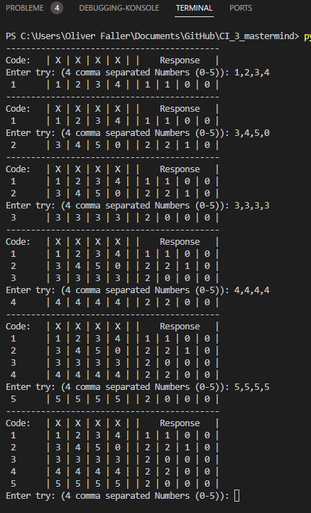
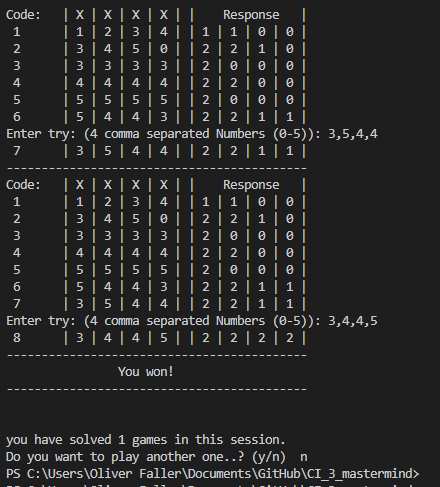
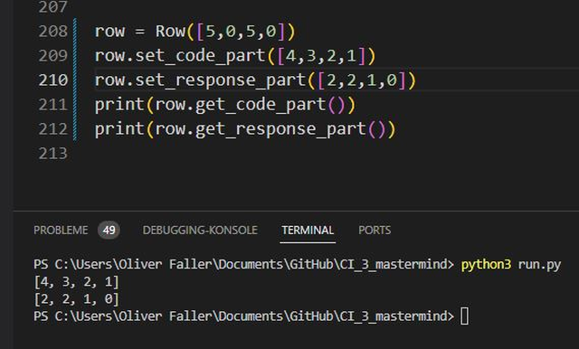
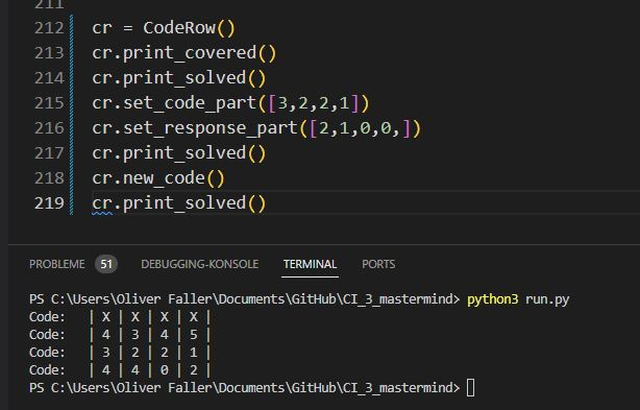
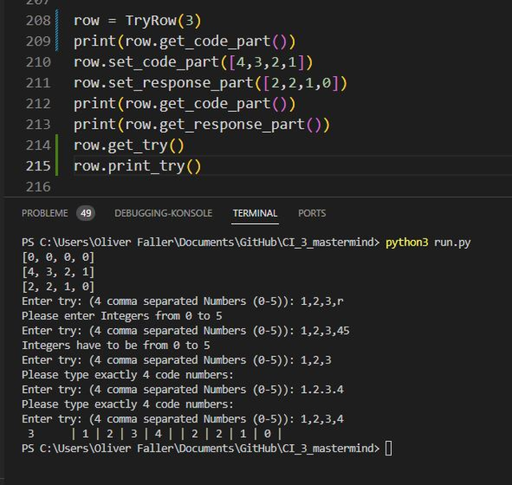
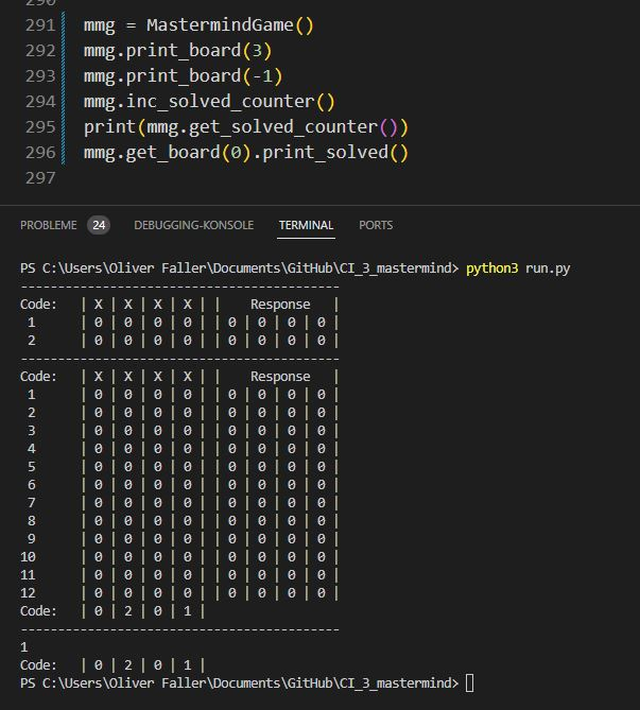
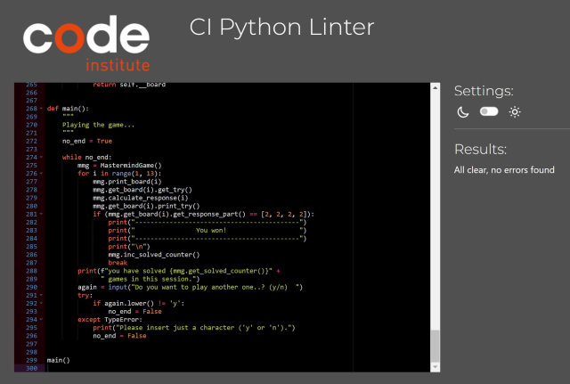

Welcome USER_NAME,

this is my project 3 Python terminal game "Mastermind", which runs in a mock terminal on Heroku.

## How to play

In this game you have to find a four-digit code of numbers from 0 - 5. in the boardgame there are
pins of six colors.

So you will be asked for your first guess. Type in a row of 4, comma-separated numbers (0 - 5).
If you've typed a number out of range, or less or too much, as well as when you typed in a character
you will be informed and have the chace to do it right.

When you gave your guess to the input, the computer gives back a response:
* 2, for every number, that is on the right position (black pin)
* 1, for every that is in the code, but on the wrong position (white pin)
* 0, trailling zeros, to fill the list
With this informations you guess again, until you've found the code.

At the end the solved_counter is shown to you and you will be asked, if you want to play again...

## Features

### Existing Features

### Future Features

## Data Model

The Mastermind gameboard is made of a covered CodeRow for one player and
twelve rows (TryRows) for the opponent to set his trials. At the end the
CodeRow is shown to the other player.

So the __board of my MastermindGame-Class is made of:
    *  1x covered CodeRow
    * 12x TryRows
    *  1x uncovered CodeRow.

By the fact, that CodeRow and TryRows are basically Rows, they inherit 
from the Class Row.

The Class Row has two private attributes __code_part and __response_part,
what followed from the split of the (real) gameboard. And their getters
and setters.

Class CodeRow, is a Row, with an additional creation of a code by initialization.
a .new_code() method to play a  new game and two print methods, to cover or uncover
the code.

Class TryRow, is a Row, with a method to get the try (get_try()) from the user 
and check it on range, type and count. Additionally there is a print_try() method.

The MatermindGame Class has two private attributes the __board,
as described above and a __solved_counter, to count the solved
games of the session. Beside the getters for these attributes, an increment-method for the __solved_counter and a print_board()
method, there is the calculate_response() method, which checks the trial and respond to the player. This was the trickiest part of the game and I've tested it with the main() function at the end of the
process.

## Testing

I've tested every Class and it's methods with a separate test run.

### Class Row

### Class CodeRow

### Class TryRow

### Class MastermindGame

### main() function

This function was tested by playing the game (like a lot ;-) to see how the calculate_response() methods works. In the process I've tried to polish the 'look' of the game, as far as it is possible for a terminal based game.

### Bugs

### Remaining Bugs

* No bugs remaining

### Validator Testing

* PEP8: no errors found in the CI Python Linter on https://pep8ci.herokuapp.com/

## Deployment

This project was deployed using Code Institute's mock terminal for Heroku.

Steps to deployment:
    * 

## Credits
* Code Institute for the opportunity to learn Python
* Mordechai Meirovitz for the invention of the game "Mastermind"